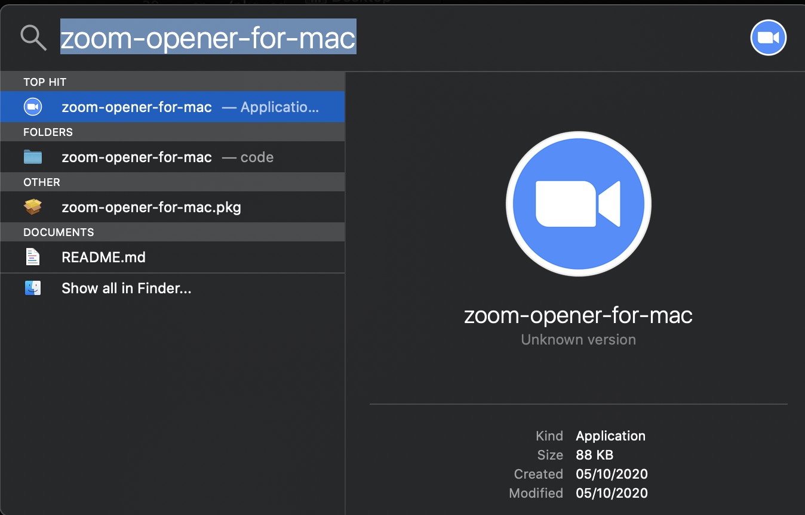

# zoom-opener-for-mac
A Mac app for opening zoom meetings as an application, and also from Spotlight

## Using the app
After installing, the app is found in the LaunchPad and also available from Spotlight




## Creating your own app

To create your own Zoom meeting opener app, you can run the script 
[`create-app.sh`](./create-app.sh) that bundles a 
`.pkg` installer file of your app.

#### Usage
```bash
./create-app.sh "app-name" "bundle-identifier" /path/to/icon.icns "zoom-domain" "zoom-meeting-id" ["zoom-meeting-password"]
```
(`zoom-meeting-password` is optional if the meeting has password).

For example:
```bash
./create-app.sh "Open Zoom" "zoom.open.my-company.com" ~/my-icongs/zoom-icon.icns "us04web.zoom.us" "77950543638" ["password"]
```

After running the script, a `.pkg` in the root directory of this repository will be created.
This file will be the Zoom app installer, and will be called `<app-name>.pkg`, where `<app-name>`
is the name you passed as the first argument.

##### Arguments
|Argument|Description|
|:-------|:---------:|
|`app-name`|The name of the app (will be the display name, and also the name for Launchpad and Spotlight)|
|`/path/to.icon.icns`|The path to your icon (The default is Zoom's icon)|
|`zoom-domain`|The domain of the Zoom meeting|
|`zoom-meeting-id`|The ID of the Zoom meeting|
|`zoom-meeting-password`|Optional: The password of the Zoom meeting|

##### Location
The application is installed to `/Applications/<app-name>.app`, where `<app-name>`
is the name you passed as the first argument.